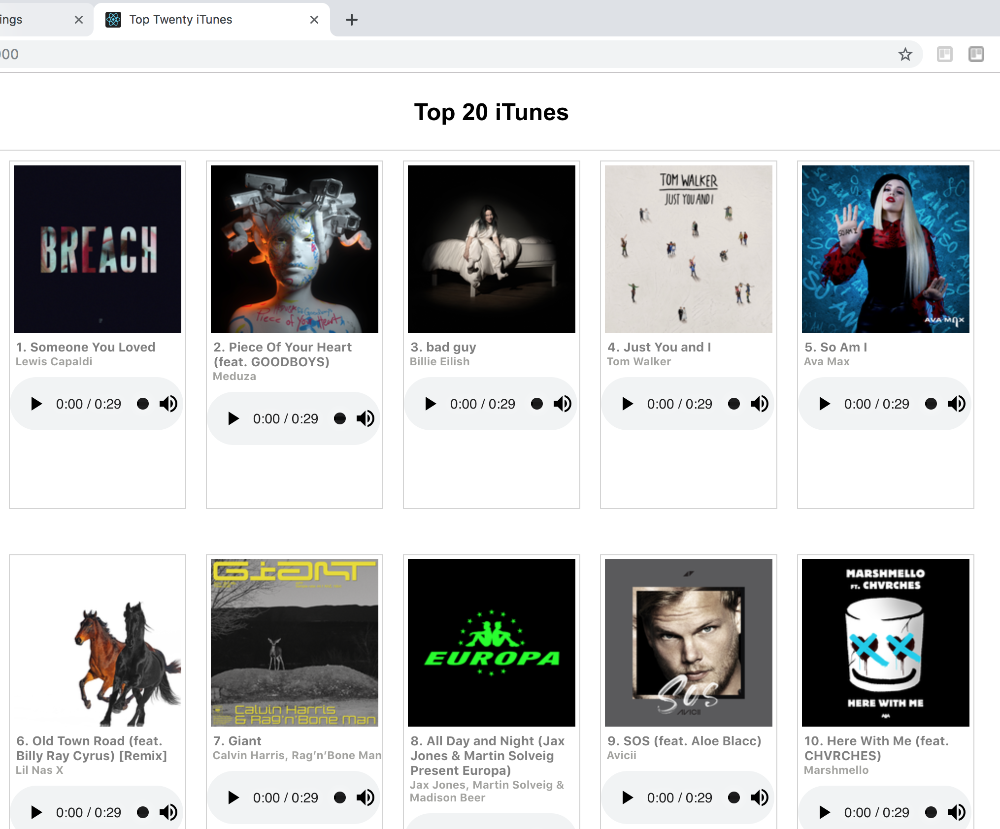

# Homework

## Learning objectives
- Practise making a request in a React app and passing the data from that request down the chain of components
- Practise using stateless components

## Task

Made a simple React app that displayed the current UK top 20 songs. Using:

https://itunes.apple.com/gb/rss/topsongs/limit=20/json

I used a stateless component as part of the app. 

The MVP was to request the data, then display the list of songs with each song showing its chart position, title and artist. 

## Extensions
I included a picture and some sample audio

